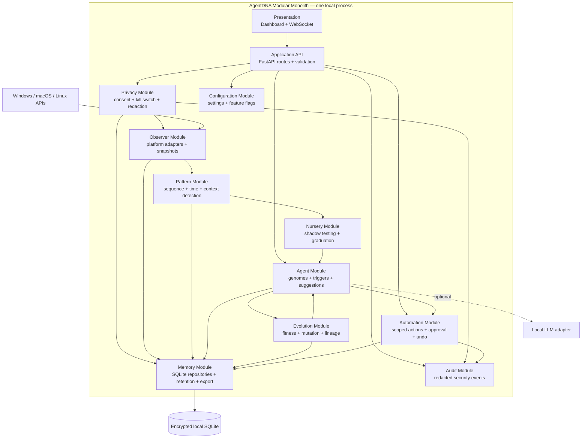

# AgentDNA 🧬

> **A privacy-first personal AI swarm that adapts to the way you work.**
>
> Observe patterns. Grow helpful agents. Retire the noise.

[](STATUS.md)
[](TESTING.md)
[](docs/architecture.md)
[](requirements.txt)

AgentDNA is an experimental local-first desktop assistant inspired by natural selection. Instead of forcing users to write automation rules, it is designed to discover useful work patterns, propose small specialized agents, test them quietly, and let feedback determine which agents survive.

**Privacy is a product feature, not a footnote:** monitoring is disabled by default, applications must be explicitly allowlisted, and the observer is limited to metadata such as application names, window titles, timing, and transitions. It does not collect keystrokes, passwords, form fields, message contents, or clipboard contents.

> ⚠️ **NOT PRODUCTION READY:** Functional prototype. Missing logging, database encryption, desktop packaging. See [PRODUCTION_READINESS.md](PRODUCTION_READINESS.md) for details. Safe for local testing only.

---

## ✨ What makes it different?

Most automation tools ask you to define the rules first. AgentDNA explores a different loop:

```text
Observe → Detect → Propose → Shadow-test → Suggest → Learn → Evolve
```

Agents have a lifecycle:

```text
NURSERY → ACTIVE → DORMANT → DEAD
```

Helpful agents gain fitness. Irrelevant or annoying agents lose fitness, go dormant, or are removed. Successful agents can reproduce with mutated traits such as trigger timing, confidence threshold, tone, and action type.

## Product vision

- A Shortcut Scout that notices repeated menu sequences
- A Research Scout that helps after recurring work-to-browser transitions
- A Focus Companion that learns when breaks are actually useful
- A Template Helper that recognizes repeated messages and documents
- A Workflow Mapper that finds multi-application routines
- A quiet, explainable assistant that earns trust instead of demanding it

## Current dashboard

The included interface provides:

- Overview and evolution trajectory
- Live-context snapshot UI
- Agent population and fitness
- Observed pattern candidates
- Evolution and lineage view
- Privacy control room
- Explicit application permissions
- Settings for quiet hours and safety defaults
- Data deletion controls

## Architecture — modular monolith

AgentDNA follows a **modular monolithic architecture**: one locally deployed application and one process boundary, with strict internal module boundaries. This keeps development, deployment, privacy review, and local data ownership simple while allowing individual modules to evolve independently.



### Module boundaries

| Module | Owns | Must not do |
|---|---|---|
| `observer` | Native window metadata and snapshots | Read keystrokes or bypass privacy |
| `privacy` | Consent, allowlist, blocklist, redaction, kill switch | Generate suggestions |
| `patterns` | Evidence and confidence-scored patterns | Capture OS data directly |
| `agents` | Agent state, genomes, triggers, suggestion contracts | Execute unapproved actions |
| `nursery` | Shadow predictions and graduation | Interrupt the user |
| `evolution` | Fitness, mutation, crossover and lineage | Access native OS APIs |
| `automation` | Scoped actions, confirmation and undo | Send or delete without permission |
| `memory` | Repositories, retention, export and deletion | Contain business logic for agents |
| `api` | Validation, orchestration and transport | Implement domain rules inline |

### Dependency rules

1. All OS observation goes through `privacy` before entering `observer` storage.
2. Domain modules communicate through typed contracts, not UI imports.
3. Modules never import FastAPI or browser code.
4. Repositories are accessed through the memory boundary.
5. Automation is deny-by-default and cannot execute directly from a pattern detector.
6. The UI communicates only through the API/WebSocket boundary.
7. Optional LLM providers implement an adapter interface and are never required for local-only mode.
8. Every state-changing operation emits a redacted audit event.

The current repository is the first implementation of this modular monolith; the package layout is intentionally ready to be expanded into the boundaries above. Read the complete design in [docs/architecture.md](docs/architecture.md), and the product screens in [docs/wireframe.md](docs/wireframe.md).

## 🚀 Run locally

Requirements:

- Python 3.11+
- Optional: `xdotool` and `psutil` for Linux active-window metadata
- macOS Accessibility permission for AppleScript-based window metadata

```bash
git clone <your-repository-url>
cd agentdna
python -m venv .venv
source .venv/bin/activate       # Windows: .venv\\Scripts\\activate
pip install -r requirements.txt
./run.sh                         # Windows: python -m uvicorn backend.main:app --host 127.0.0.1 --port 8000
```

Open [http://127.0.0.1:8000](http://127.0.0.1:8000).

The server binds to loopback by default. Monitoring remains **OFF** after startup.

### CLI installation and commands

Yes—AgentDNA can be installed and operated from the command line:

```bash
./install.sh
./agentdna-cli.sh start
```

The installer creates `.venv`, installs dependencies, runs the automated tests, and compiles the backend before reporting success.

Available commands:

```bash
./agentdna-cli.sh start    # start local API and dashboard
./agentdna-cli.sh test     # run automated tests
./agentdna-cli.sh compile  # compile-check backend
./agentdna-cli.sh health   # check a running server
./agentdna-cli.sh privacy  # inspect privacy state
./agentdna-cli.sh pause    # activate the global kill switch
```

Equivalent Make commands are also available:

```bash
make install
make start
make test
make check
```

On Windows, use the equivalent Python commands or add a PowerShell installer; the current shell scripts target macOS, Linux, and WSL.

### Explicitly enable an application

```bash
curl -X POST http://127.0.0.1:8000/api/privacy/allow \
  -H 'Content-Type: application/json' \
  -d '{"app_name":"Code"}'

curl -X POST http://127.0.0.1:8000/api/privacy/resume
curl http://127.0.0.1:8000/api/privacy
```

Pause all observation immediately:

```bash
curl -X POST http://127.0.0.1:8000/api/privacy/pause
```

Delete local activity and history:

```bash
curl -X DELETE http://127.0.0.1:8000/api/privacy/data
```

## 🧠 Vector search, RAG and bounded ReAct

AgentDNA now includes optional, privacy-aware building blocks for retrieval and reasoning:

```text
Approved metadata → local embeddings → rebuildable vector index
                                      ↓
Current context → semantic retrieval → grounded suggestion
                                      ↓
                         bounded ReAct plan → safety policy → user confirmation
```

- **Vector search:** a dependency-free local similarity index is available at `/api/retrieval/*`. It is a rebuildable index, not the source of truth.
- **RAG:** `/api/ai/suggestion` retrieves approved local evidence before generating a suggestion.
- **ReAct:** `/api/reasoning/plan` returns a bounded plan using an allowlisted tool set. It cannot run arbitrary shell commands or bypass confirmation.
- **LLM:** default operation is safe mock/local fallback. Ollama, OpenAI-compatible endpoints, and OpenRouter are opt-in.
- **OpenRouter:** choose any available model by changing one model string; the provider uses the OpenAI-compatible `/chat/completions` API and sends no key to the browser.
- **SQLite:** remains the authoritative store for feedback, audit data, settings and future persistent agents. Vector data must be treated as a cache that can be rebuilt.

### Choosing a powerful model through OpenRouter

OpenRouter lets you switch models without changing AgentDNA's reasoning or safety layer.

1. Create an OpenRouter API key.
2. Configure the process environment:

```bash
export AGENTDNA_LLM_MODE=openrouter
export AGENTDNA_LLM_BASE_URL=https://openrouter.ai/api/v1
export AGENTDNA_LLM_API_KEY='your-key-from-a-secret-manager'
export AGENTDNA_LLM_MODEL='anthropic/claude-sonnet-4'
export AGENTDNA_APP_URL='http://127.0.0.1:8000'
export AGENTDNA_APP_NAME='AgentDNA'
./run.sh
```

You can replace the model with any model ID supported by your OpenRouter account, for example an OpenAI, Google, Anthropic, Qwen, DeepSeek, or other supported model. Check the provider's current model catalog for exact IDs, availability, and pricing.

Verify the configuration without exposing the secret:

```bash
curl http://127.0.0.1:8000/api/ai/status
```

The response reports only `api_key_configured: true/false`, never the key itself.

**Security:** do not put API keys in `index.html`, `app.js`, Git, screenshots, browser requests, or a committed `.env` file. Use environment injection, an OS keychain, or a desktop-shell secret store. Cloud prompts must be redacted and cloud mode must be explicitly enabled.

### Connecting a local Ollama model

1. Install Ollama from [ollama.com](https://ollama.com).
2. Pull a model:

```bash
ollama pull llama3.2
```

3. Configure the environment before starting AgentDNA:

```bash
export AGENTDNA_LLM_MODE=ollama
export AGENTDNA_LLM_BASE_URL=http://127.0.0.1:11434
export AGENTDNA_LLM_MODEL=llama3.2
./run.sh
```

### Connecting an OpenAI-compatible provider

Use a compatible local gateway or provider endpoint:

```bash
export AGENTDNA_LLM_MODE=openai_compatible
export AGENTDNA_LLM_BASE_URL=https://your-compatible-endpoint/v1
export AGENTDNA_LLM_MODEL=your-model
./run.sh
```

Do not put API keys in `.env`, source control, browser code, or request payloads. Add a keychain-backed secret adapter before enabling cloud providers in production. Cloud use must be explicitly disclosed and sensitive metadata must be redacted first.

### Database location

The current SQLite database is created at:

```text
backend/agentdna.db
```

It stores local feedback, patterns, settings and audit events. Back it up only when the user requests it. Production packaging should move it to the OS application-data directory and encrypt it with the OS keychain. The vector index is currently an in-memory rebuildable cache; a future release should persist it separately or rebuild it from SQLite at startup.

## API surface

| Endpoint | Purpose |
|---|---|
| `GET /api/health` | Service health |
| `GET /api/privacy` | Privacy state |
| `POST /api/privacy/allow` | Explicitly allow an app |
| `POST /api/privacy/pause` | Global kill switch |
| `POST /api/privacy/resume` | Resume monitoring |
| `DELETE /api/privacy/data` | Delete local activity and history |
| `GET /api/activity` | Recent metadata snapshots |
| `GET /api/patterns` | Pattern candidates |
| `GET /api/agents` | Population state |
| `POST /api/agents/feedback` | Update agent fitness |
| `GET /api/evolution` | Evolution history |
| `POST /api/evolution/run` | Run an evolution cycle |
| `GET/POST /api/automations` | Permissioned automation records |
| `GET/PUT /api/settings` | Behavior settings |
| `WS /ws` | Live-update channel foundation |

## 🛡️ Privacy model

AgentDNA must pass every observation through this gate:

```text
Monitoring enabled?
  → Application allowlisted?
  → Blocked/private context?
  → Sensitive title redaction?
  → Metadata-only normalization?
  → Local persistence
```

Never captured by design:

- Keystrokes
- Passwords
- Form fields
- Message contents
- Financial information
- Clipboard contents

The current observer is deliberately conservative. Native OS adapters are best-effort and still require explicit user permission and allowlisting.

## 🧪 Testing

Run the verified core suite:

```bash
python -m unittest discover -s tests -v
python -m compileall -q backend
node --check app.js
```

Current verified result: **19 core and safety tests passing**.

The complete production test matrix still needs platform, API, UI, security, packaging, and end-to-end coverage. See [TESTING.md](TESTING.md) and [STATUS.md](STATUS.md).

## 🗺️ Roadmap

### Phase 1 — Trust foundation

- [x] Privacy guard with safe default
- [x] Application allowlist
- [x] Global pause API
- [x] Local activity and feedback persistence
- [x] Agent fitness model
- [x] Architecture and wireframes
- [x] Core automated tests
- [x] Sensitive metadata redaction
- [x] Bounded nursery lifecycle foundation
- [x] Preview-only automation executor
- [x] Model routing and structured AI output validation

### Phase 2 — Useful intelligence

- [ ] Persistent agent/genome storage
- [ ] Advanced sequence and time-pattern mining
- [ ] Full nursery shadow evaluation
- [ ] Explainable suggestion cards
- [ ] Local LLM adapter
- [ ] Native notification service

### Phase 3 — Safe desktop automation

- [ ] Tauri desktop shell
- [ ] Native OS permission screens
- [ ] Reversible actions with undo
- [ ] Browser extension
- [ ] Signed installers
- [ ] Encrypted database and keychain integration

### Phase 4 — Production confidence

- [ ] Windows/macOS/Linux CI builds
- [ ] API and WebSocket integration tests
- [ ] UI and end-to-end tests
- [ ] Security review
- [ ] Privacy review
- [ ] Crash recovery and update testing

## 🤝 Contributing

AgentDNA is intentionally open to ideas from people who care about useful automation and respectful software.

Good first contributions:

- Add a new pattern detector
- Improve privacy redaction rules
- Add tests for an API route
- Improve the dashboard accessibility
- Add a platform observer adapter
- Create an agent type
- Improve documentation
- Design a reversible automation

### Development workflow

```bash
git checkout -b feat/your-idea
python -m unittest discover -s tests -v
python -m compileall -q backend
node --check app.js
git commit -m "feat: describe your change"
git push origin feat/your-idea
```

Please include:

- What changed
- Why it changed
- Privacy implications
- Tests added or run
- Screenshots for UI changes

### Contribution principles

1. Privacy defaults must never become weaker.
2. No silent monitoring.
3. No collection of content when metadata is enough.
4. Automations must be scoped and reversible.
5. Every important behavior needs a test.
6. User control is more important than agent autonomy.

## 📄 License and open source

AgentDNA is released under the MIT License. See [LICENSE](LICENSE).

This project is designed to be built in public. Contributions are welcome from developers, designers, security researchers, privacy advocates, accessibility specialists, and people who simply have a repetitive workflow worth improving.

Read:

- [CONTRIBUTING.md](CONTRIBUTING.md)
- [CODE_OF_CONDUCT.md](CODE_OF_CONDUCT.md)
- [SECURITY.md](SECURITY.md)
- [GOVERNANCE.md](GOVERNANCE.md)

## ⭐ Support the project

If the idea of a personal assistant that earns trust through usefulness resonates with you:

- Star the repository
- Try the prototype
- Open an issue with a workflow to improve
- Share privacy and safety feedback
- Contribute an agent, detector, adapter, test, or design
- Help validate the project on another operating system

AgentDNA should not become an assistant that watches everything. It should become a small, trusted ecosystem of tools that helps because it has earned the right to help.
