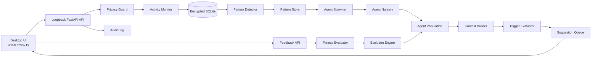

# AgentDNA — Full Architecture

## Product boundary

AgentDNA is a local-first desktop assistant. The observer is disabled by default. It may collect only app names, window titles, timestamps, duration and transition metadata after explicit per-app opt-in. It must never collect keystrokes, form contents, passwords, financial data or clipboard contents.

## System overview



## Modular monolith boundary

AgentDNA is deployed as one local application, not as a fleet of network microservices. The monolith is internally modular so privacy-critical behavior and domain logic remain isolated and testable.

```text
agentdna/
├── backend/
│   ├── main.py                 # composition root and transport wiring
│   ├── observer/               # OS metadata adapters and snapshots
│   ├── privacy/                # consent, allowlist, redaction, kill switch
│   ├── patterns/               # pattern contracts and detectors
│   ├── agents/                 # agent domain and suggestion contracts
│   ├── evolution/              # fitness, mutation, lineage
│   ├── nursery/                # shadow evaluation and graduation
│   ├── automation/             # approvals, execution and undo
│   ├── memory/                 # repositories and retention
│   ├── audit/                  # redacted state-change events
│   ├── settings/               # validated configuration
│   ├── ai/                     # LLM and embedding provider adapters
│   ├── retrieval/              # rebuildable local vector index and RAG
│   └── reasoning/              # bounded ReAct planner and tool policy
├── tests/                      # unit, integration and end-to-end suites
├── docs/                       # product and architecture docs
└── frontend/                   # dashboard presentation layer (current UI files are at root)
```

### Dependency direction

```text
transport/API → application orchestration → domain modules → repositories
                                      ↘ privacy gate → observer adapters → OS
```

The current codebase keeps some of these modules compact while the product is being assembled; they are deliberately separated by responsibility and can be split into the package layout above without changing the public API.

Rules:

- `main.py` is the composition root; domain modules do not import FastAPI.
- The observer cannot persist or publish data without the privacy gate.
- Pattern detection consumes snapshots; it never reads the OS.
- Agents consume typed context and pattern contracts; they never access native APIs.
- Automation is deny-by-default, approval-gated and reversible.
- Repositories own persistence; domain modules do not issue SQL directly.
- The UI depends on the API only, never on backend internals.
- Optional LLM providers implement an adapter and are disabled in local-only mode.

## Runtime components

### Desktop shell

A future signed Tauri or Electron shell should:

- Start the local API on an ephemeral loopback port.
- Display native permission prompts before enabling observation.
- Register a global privacy hotkey.
- Show native notifications only after the user opts in.
- Stop all child processes and monitoring on exit.

The current project works as a browser-based desktop dashboard and can be wrapped without changing the API.

### API layer

| Route | Purpose |
|---|---|
| `GET /api/health` | Health and monitoring state |
| `GET /api/privacy` | Current privacy configuration |
| `POST /api/privacy/pause` | Immediate global kill switch |
| `POST /api/privacy/resume` | Resume after explicit user action |
| `POST /api/privacy/allow` | Opt an app into metadata observation |
| `DELETE /api/privacy/data` | Delete activity, patterns and audit data |
| `GET /api/activity` | Recent metadata snapshots |
| `GET /api/patterns` | Detected pattern candidates |
| `GET /api/agents` | Population and fitness |
| `POST /api/agents/feedback` | Record user feedback and update fitness |
| `GET /api/evolution` | Generation state and history |
| `POST /api/evolution/run` | Run an evolution cycle manually |
| `GET/POST /api/automations` | Review and create permissioned automations |
| `GET/PUT /api/settings` | Safety and behavior settings |
| `WS /ws` | Live state updates |

## Data model

### ActivitySnapshot

```text
id, timestamp, app_name, window_title, duration_seconds,
switch_from, clipboard_type, privacy_scope
```

Only `clipboard_type` may be stored. Clipboard content itself is prohibited.

### DetectedPattern

```text
id, kind, description, confidence, evidence_count,
first_seen, last_seen, status, source_snapshot_ids
```

Pattern statuses: `PROPOSED`, `APPROVED`, `IGNORED`, `ARCHIVED`.

### Agent

```text
id, name, agent_type, state, generation, fitness,
genome_json, created_at, last_triggered_at,
suggestions, accepted, dismissed, cooldown_minutes
```

States: `NURSERY`, `ACTIVE`, `DORMANT`, `DEAD`.

### Feedback

```text
id, agent_id, suggestion_id, response,
response_time_ms, created_at
```

Responses: `ACCEPTED`, `DISMISSED`, `IGNORED`, `THUMBS_UP`, `THUMBS_DOWN`, `STOP`, `NEVER`.

## Safety pipeline

Every observer sample must pass this sequence:

```text
OS event
  → monitoring_enabled?
  → app explicitly allowed?
  → blocked/private app check
  → sensitive title redaction
  → metadata-only normalization
  → local persistence
```

If any check fails, the event is discarded rather than queued.

## Evolution lifecycle

1. Pattern detector analyzes the last 24 hours.
2. Patterns above the configured confidence threshold become candidates.
3. Duplicate patterns are removed by normalized trigger similarity.
4. Spawner creates a random genome and places the agent in the nursery.
5. Nursery agents shadow-trigger for three days without interrupting the user.
6. Agents above 60% prediction accuracy graduate.
7. Active agents produce suggestions subject to cooldowns and quiet hours.
8. Feedback updates fitness and agent state.
9. Daily evolution kills low-fitness agents and mutates high-fitness genomes.
10. Every birth, death and mutation is written to the audit history.

## Fitness

```text
starting fitness: 50
accepted: +15
helpful: +25
dismissed: -3
ignored after 30s: -1
stop suggesting: -30 and dormant
never show again: dead
inactive for 7 days: -5
```

Fitness is clamped to 0–100. The engine also tracks precision, timing accuracy, interruption rate and net value:

```text
net_value = estimated_minutes_saved - interruption_cost
```

## Deployment architecture

### Development

```text
uvicorn backend.main:app --reload --port 8000
```

### Production desktop

```text
Signed desktop shell
  ├── local FastAPI process
  ├── encrypted SQLite database
  ├── native observer adapter
  ├── local model adapter (optional)
  └── notification adapter
```

Recommended production controls:

- Bind API to `127.0.0.1` only.
- Use a per-launch random bearer token between shell and API.
- Encrypt database and secrets with the OS keychain.
- Sign native observer binaries.
- Add structured redacted logs.
- Add migration tests and crash-recovery tests.
- Keep cloud AI disabled unless the user explicitly enables it.
